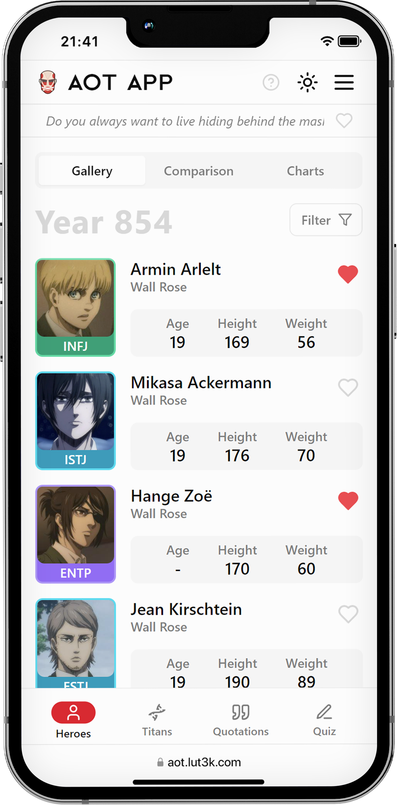

<div align="center">
  
</div>

## About

AOT APP is a fan-made web application based on the popular anime Attack on Titan. It was created for
fans who want to improve their viewing experience and deepen their knowledge of the series&apos; rich universe.

Explore the app: <a href="https://aot.lut3k.com" target="_blank">aot.lut3k.com</a>

<div align="center">
  
</div>

## Features

### Discover

- **Character Gallery:** Find information about any character quickly and easily.
- **Quote Gallery:** Browse quotes and rediscover the wisdom and humor of the characters.

### Analyze

- **Comparison Tool:** Compare different characters and discover the differences between them.
- **Statistics (coming soon):** Discover hidden relationships and patterns.

### Personalize

- **Favorites:** Save your favorite characters and quotes for easy access.

### Test

- **Quizzes:** Test your knowledge of the characters, titans, and anime story.

## Tech stack

- **Frontend:** React, TypeScript
- **State Management:** Redux
- **Styling:** Tailwind CSS
- **Routing:** React Router v6
- **Internationalization:** i18next
- **Code Quality:** Prettier, ESLint

## Contribution

While AOT APP is primarily developed and maintained by me, I'm always open to hearing your ideas and feedback. If you encounter any bugs or have suggestions for improvements, please open an issue or start a discussion. Although I may not be able to incorporate every suggestion, your input is valuable in shaping the app's future and making it the best resource for Attack on Titan fans!

## Installation

1. Clone the Repository:

```bash
git clone https://github.com/lut3k-IT/aot-app.git
```

2. Install Dependencies:

```bash
npm install
```

3. Run the App:

```bash
npm run dev
```

## Development

- Start a local development server with hot reloading: `npm run dev`
- Create an optimized build for deployment: `npm run build`
- Test the production build locally: `npm run preview`
- Check your code for potential errors and style issues: `npm run lint`
- Automatically fix linting issues: `npm run lint-fix`
- Create a new version, update the changelog, and tag the release (for maintainers): `npm run release`
